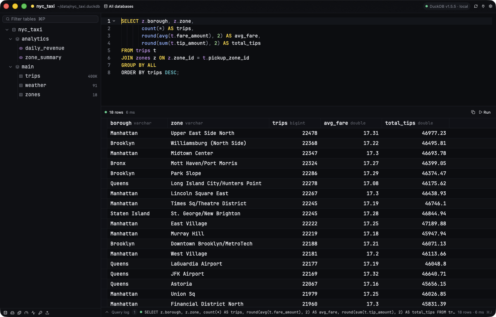
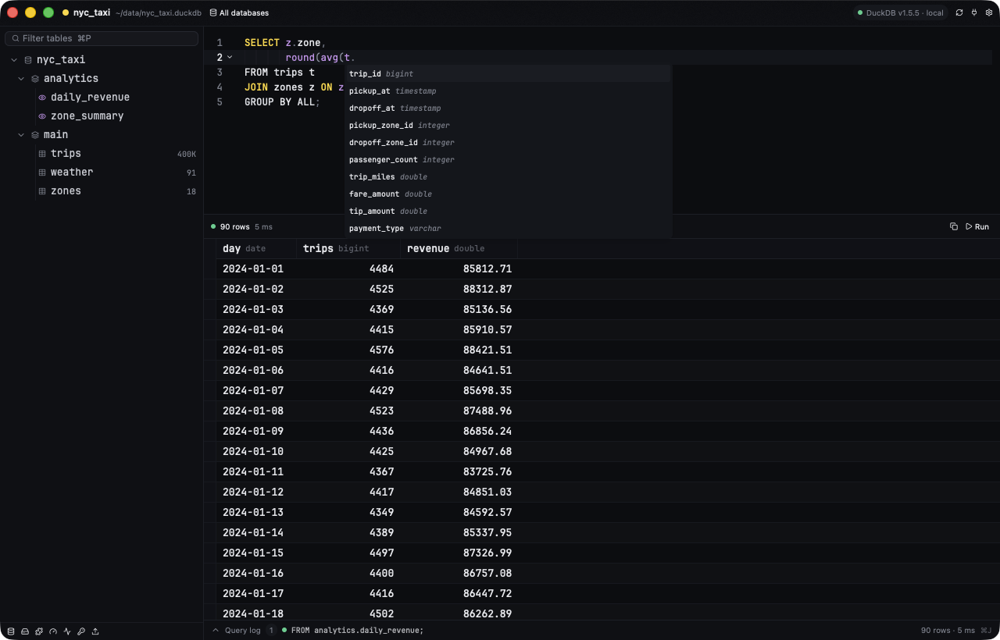
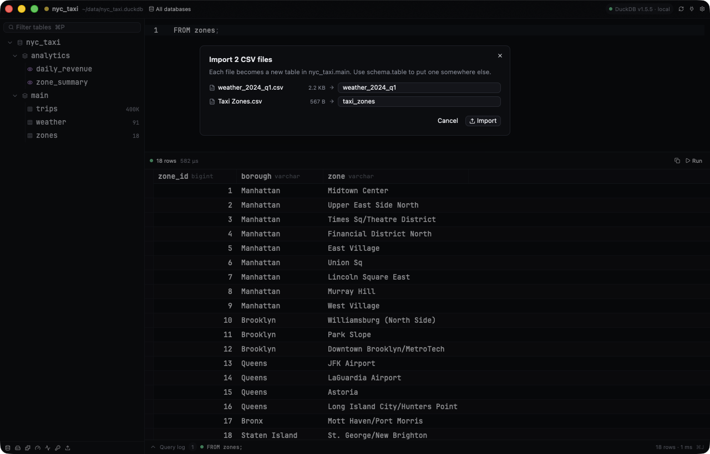

# DuckPlus

A lightning-fast, native DuckDB IDE that speaks the [Quack](https://duckdb.org/quack/) client/server protocol. Think TablePlus, but built only for DuckDB.

Built in Rust on [GPUI](https://gpui-kit.com) (the GPU-accelerated UI framework behind Zed), so it's a real native app. There's no Electron and no web view.



## Download

**[Download DuckPlus for Mac](https://github.com/wes/duckplus/releases/latest/download/DuckPlus.dmg)** (always the latest release), open it, and drag DuckPlus into Applications. Older versions are on the [Releases](https://github.com/wes/duckplus/releases) page. It's a universal app (Apple Silicon and Intel), signed and notarized by Apple, and needs macOS 12 or later.

DuckPlus checks for new versions on launch and every few hours (or via **DuckPlus → Check for Updates…**). When one is out, the connections window offers an **Update** button: it downloads the release, verifies its checksum and that it's notarized and signed by the DuckPlus team, swaps it in, and relaunches.

## Features

- **Paste and connect.** Paste a Quack endpoint and token, press ↵, and the workspace opens. Connections can be saved with a color tag (Local, Dev, Staging, Production…).
- **Tokens stay in the OS keychain.** That's the macOS Keychain, Windows Credential Manager, or Secret Service on Linux. Only connection metadata is written to disk (`~/Library/Application Support/DuckPlus/connections.json` on macOS).
- **Separate native windows** for the connection launcher, one workspace per server, and settings.
- **Schema browser.** Databases → schemas → tables and views, with row estimates, filtering (⌘P), one-click preview, and structure (`DESCRIBE`).
- **Server admin.** One-click views for databases, storage, extensions, settings, memory, secrets, and Quack servers. Each is plain SQL loaded into the editor, so you can tweak it.
- **SQL editor.** Tree-sitter highlighting and line numbers. ⌘↵ runs the whole buffer or just the selection.
- **Schema-aware autocomplete.** Tables after `FROM`/`JOIN`, columns from the tables in your query (aliases, CTEs, and subqueries included), `alias.` for one table's columns, and the server's own functions and keywords. Names are quoted when they need it.
- **Results grid.** Virtualized and cell-selectable. Results stay as Arrow batches from DuckDB and a cell is formatted only when it's on screen, so 100k-row results stay smooth.
- **CSV import.** Drop CSV files anywhere on a workspace, or pick them from the sidebar. Name each table, then watch them load side by side with a progress bar per file.
- **Guardrails.** `DROP`, `DELETE`, and `TRUNCATE` need a second ⌘↵. There's a configurable row limit, a live query timer, and Cancel (⌘.).
- **JetBrains Mono built in** for the editor, the grid, and table names, so it looks the same on every machine. Light and dark themes follow the OS or can be pinned in Settings.

<table>
  <tr>
    <td></td>
    <td></td>
  </tr>
  <tr>
    <td align="center">Autocomplete knows your tables, columns and aliases</td>
    <td align="center">Drop CSV files on the window to import them</td>
  </tr>
</table>

## How it talks to DuckDB

DuckPlus embeds an in-memory DuckDB whose only job is to speak Quack. It attaches the server once, then ships every statement over that session:

```sql
ATTACH 'quack:host:port' AS session (TOKEN '…');
SELECT * FROM quack_query_by_name('session', '<your sql>');
```

So you get the server's full SQL dialect (DDL and multiple statements included), and results arrive in DuckDB's native vector format. Each statement is a single HTTP request. A stateless `quack_query(...)` takes three (open, run, close), each on a fresh HTTPS connection, so on a server 40 ms away the session saves about 400 ms per query.

The session behaves like any database connection: temp tables, `SET` and `USE` carry over between runs. Schema lookups use a second session, so they never wait behind a long query.

Endpoints use `quack:host[:port]` (default port 9494). `localhost` uses plain HTTP and other hosts default to HTTPS. Turn on **Plain HTTP** for servers on a private network.

> Quack is in beta (stable is planned for DuckDB 2.0). Reading attached tables directly (`FROM session.schema.table`) has catalog gaps today, which is why the SQL runs on the server through `quack_query_by_name`. Quack also has no remote cancel yet. Cancel frees the UI at once and moves your next query to a fresh session, while the server finishes the abandoned statement in the background.

## Try it

Start a server:

```sql
-- duckdb my.db
CALL quack_serve('quack:localhost', token := 'super_secret');
```

Then run DuckPlus:

```sh
cargo run --release
# or jump straight in:
cargo run --release -- quack:localhost --token super_secret
cargo run --release -- quack:localhost -t super_secret -c "FROM duckdb_tables()"
```

`DUCKPLUS_TOKEN` works in place of `--token`.

The first launch downloads the `quack` extension into `~/.duckdb/extensions`, so it needs network access once.

## Shortcuts

| Keys | Action |
| --- | --- |
| ⌘↵ | Run the buffer or the selection |
| ⌘. | Cancel the query, or dismiss the destructive-query prompt |
| ⌘P | Filter tables |
| ⌘E | Focus the editor |
| ⌘R | Refresh the schema |
| ⌘N / ⌘⇧O | Connections |
| ⌘, | Settings |
| ⌘W | Close window |

## Build from source (macOS)

```sh
scripts/install.sh            # builds, installs DuckPlus.app, adds the `duckplus` CLI
scripts/install.sh --no-cli   # app only
scripts/install.sh --open     # launch the app when done
```

Rerun it to upgrade. It quits a running copy, replaces the app, and refreshes the Dock icon. The app goes to `/Applications`, or `~/Applications` if that isn't writable. The CLI goes to `/usr/local/bin`, or `~/.local/bin`. Set `DUCKPLUS_INSTALL_DIR` to install somewhere else.

## Building a macOS app

```sh
scripts/bundle-macos.sh              # target/bundle/DuckPlus.app + zip
scripts/bundle-macos.sh --universal  # arm64 + x86_64
```

The icon is rendered from code (`swift scripts/make-icon.swift assets/icon/duckplus-1024.png`).

## Releasing

```sh
scripts/release-macos.sh   # universal build → Developer ID signature → DuckPlus-<version>.dmg → notarize → staple
```

It needs a *Developer ID Application* certificate in your keychain and notarization credentials saved once:

```sh
xcrun notarytool store-credentials duckplus-notary --apple-id you@example.com --team-id TEAMID
```

Bump `version` in `Cargo.toml` and run `scripts/release-macos.sh --publish`. That creates the `v<version>` GitHub release, marked Latest, with both `DuckPlus-<version>.dmg` and `DuckPlus.dmg`. The unversioned name keeps `releases/latest/download/DuckPlus.dmg` pointing at the newest build.

## License

DuckPlus is released under the [MIT License](LICENSE).

## Credits

JetBrains Mono is © The JetBrains Mono Project Authors and licensed under the SIL Open Font License 1.1 (`assets/fonts/JetBrainsMono-OFL.txt`).

## Tests

```sh
cargo test
# live tests against a local Quack server started with token 'secret123':
DUCKPLUS_TEST_TOKEN=secret123 cargo test -- --include-ignored
```

The ignored tests use a real Quack server and the real OS keychain. The keychain test writes one throwaway entry and deletes it.

## Layout

```
src/main.rs         app bootstrap, actions, menus, window management, CLI
src/quack.rs        Quack client: quack_query wrapper, Arrow results, catalog
src/store.rs        saved connections (JSON) + keychain tokens + settings
src/theme.rs        DuckPlus Night / Day themes (assets/themes/duckplus.json)
src/connections.rs  launcher window
src/workspace.rs    workspace window: schema tree, editor, results
src/workspace/import.rs  CSV import: drop/pick, naming dialog, progress
src/complete.rs     schema-aware SQL autocomplete
src/results.rs      result grid delegate (lazy cell formatting)
src/settings.rs     settings window
src/update.rs       update checks and self-install from GitHub releases
```
